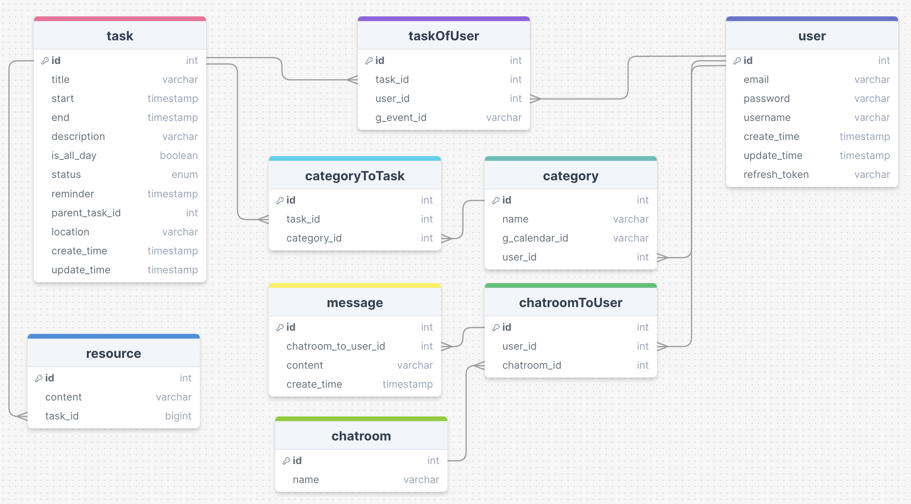

# TaskTree

TaskTree is a platform to manage your tasks. Manage your tasks, cooperate with your partners and integrate your calendar all in one.

## Description

### Features

- Hierarchical Task Visualization: Treeview presents the structure of your tasks in a clear, hierarchical manner.
- Day View for Daily Goals: The Day View feature is designed to highlight your tasks for the day.
- Collaborative Chatroom: built-in chatroom facilitates real-time discussions with your partners, ensuring everyone is aligned and can share insights, updates, and feedback instantaneously.
- Google Calendar Integration: This feature allows you to synchronize your tasks with your calendar, providing a holistic view of your deadlines and commitments.

## Tech stack and frameworks

### Frontend

- Vite
- React.js
- FullCalendar
- TypeScript
- MUI
- react-route-dom

### Backend

- Node.js
- Express.js
- Socket.io
- OAuth
- RabbitMQ

### Deployment

- GCP

### DB schema

_This is a personal project for personal uses_
